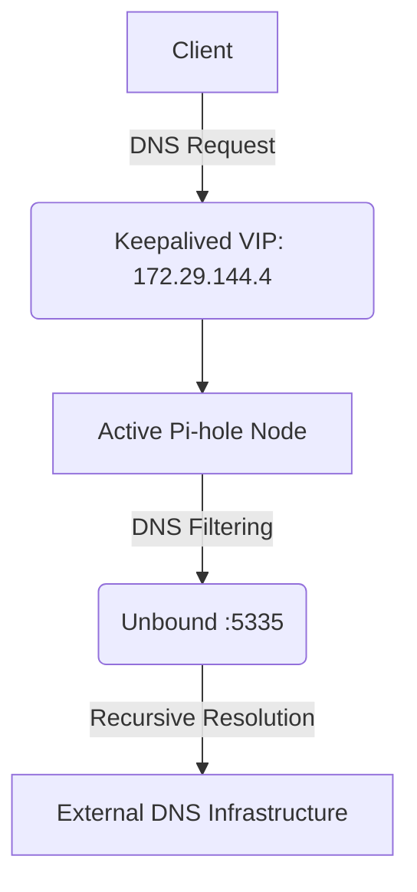

# 🛡️ Pi-hole High Availability Homelab

> A production-inspired DNS infrastructure lab built to guarantee zero-downtime ad-blocking, utilizing Linux, Keepalived/VRRP, and a dedicated Prometheus monitoring stack.

[](https://www.debian.org/)
[](https://pi-hole.net/)
[](https://www.nlnetlabs.nl/projects/unbound/)
[](https://prometheus.io/)
[](https://grafana.com/)

## 📖 The "Why"
A single Pi-hole is incredible for network-wide ad-blocking and privacy. However, if that single node goes offline—due to OS updates, hardware reboots, or failure—your entire network loses DNS resolution. In short: no DNS means no internet. 

This project solves this by using two Pi-hole nodes with Keepalived/VRRP for automatic failover, alongside Unbound for recursive DNS, and a dedicated VM for total observability.

---

## 🏗️ Architecture & Infrastructure

DNS clients use a single Keepalived Virtual IP (VIP). The active Pi-hole node handles DNS filtering and forwards recursive queries to its local Unbound resolver.

| Host        |     IP Address | Role                        |
| ----------- | -------------: | --------------------------- |
| `pihole01`  | `172.29.144.3` | Primary Pi-hole + Unbound   |
| `pihole02`  | `172.29.144.2` | Secondary Pi-hole + Unbound |
| `monitor01` | `172.29.144.5` | Monitoring VM               |
| **HA VIP**  | **`172.29.144.4`** | **Client-facing DNS**   |

*(Built on Debian 13 utilizing Oracle VirtualBox).*



---

## 🚀 Critical Prerequisites & Quick Start

Before diving into the detailed documentation, ensure your network is prepped:

1. **Static IPs:** You *must* assign static IP addresses to both Pi-hole nodes (`172.29.144.2` and `.3`) at the OS level before running the Pi-hole installer.
2. **Upstream DNS:** During Pi-hole installation, configure the upstream DNS to point to the local Unbound instance (`127.0.0.1#5335`).
3. **Router Handoff:** Log into your router and change the LAN DHCP DNS settings to point **only** to the Keepalived VIP (`172.29.144.4`).
4. **Synchronization:** To keep adlists, whitelists, and blacklists identical across both nodes, implement a synchronization framework (detailed in `docs/backup.md`).

---

## 📊 Monitoring & Observability

A dedicated monitoring VM (`172.29.144.5`) provides observability for the DNS infrastructure.

* **Metrics Collection:** Prometheus
* **Dashboards:** Grafana
* **Exporters:** Node Exporter (system), Pi-hole Exporter (application), Blackbox Exporter (active service monitoring)
* **Alerting:** Alertmanager with Telegram notifications

---

## 📚 Documentation Directory

For step-by-step setup, refer to the `docs/` directory:

| Document                                   | Description                                    |
| ------------------------------------------ | ---------------------------------------------- |
| [Installation](docs/installation.md)       | Initial system and infrastructure setup        |
| [Pi-hole](docs/pihole.md)                  | Pi-hole DNS filtering configuration            |
| [Unbound](docs/unbound.md)                 | Recursive DNS configuration                    |
| [Keepalived](docs/keepalived.md)           | High-availability and VIP configuration        |
| [Backup & Sync](docs/backup.md)            | Backup and node synchronization framework      |
| [Monitoring](docs/monitoring.md)           | Prometheus, Grafana, exporters and alerting    |

---

## 🛠️ Testing & Troubleshooting

This project uses a layered troubleshooting methodology to isolate failures:
`Network` → `OS` → `Unbound` → `Pi-hole` → `Keepalived` → `VIP` → `Monitoring` → `Alerting`

**Quick Validation Commands:**
```bash
# Test HA VIP Resolution
dig example.com @172.29.144.4

# Validate Unbound Configuration
sudo unbound-checkconf

# Validate Keepalived Configuration
sudo keepalived -t
```
*See [Troubleshooting](docs/troubleshooting.md) for full diagnostic procedures.*

---

## 🔐 Security & Disclaimer

**Disclaimer:** This is a personal homelab project created for educational purposes. IP addresses documented here are specific to this lab environment.

**Security Note:** The Pi-hole administration and monitoring interfaces should not be exposed directly to the public Internet. Never commit passwords, API tokens, Telegram bot tokens, or SSH keys to this repository.