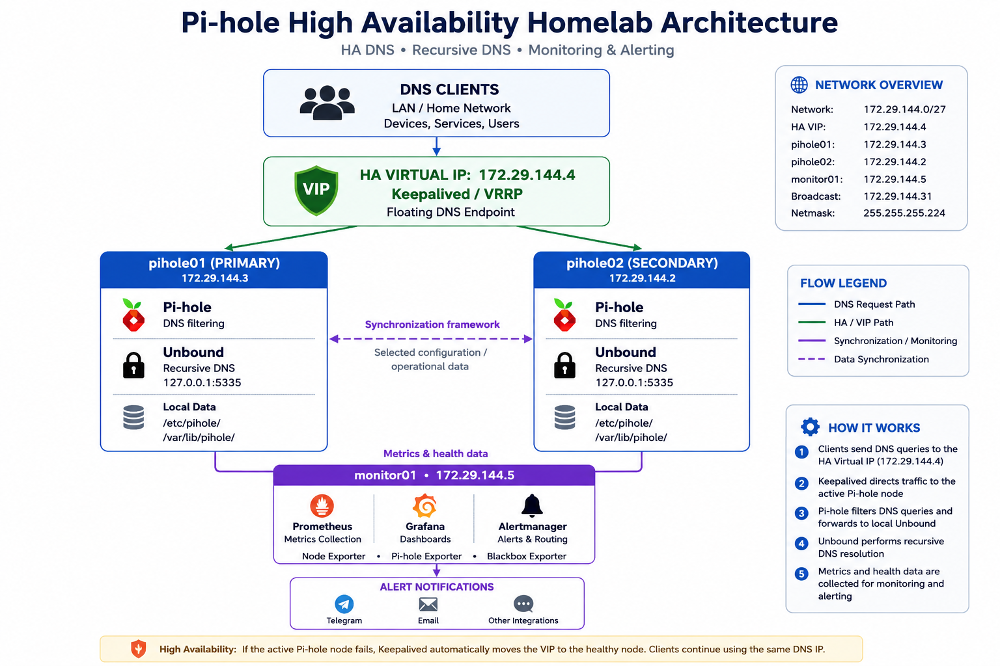

# Pi-hole High Availability Homelab

> A production-inspired DNS infrastructure lab built to explore Linux, networking, DNS, high availability, monitoring, and infrastructure troubleshooting.

[](https://www.debian.org/)
[](https://pi-hole.net/)
[](https://www.nlnetlabs.nl/projects/unbound/)
[](https://prometheus.io/)
[](https://grafana.com/)

This project uses two Pi-hole nodes with Keepalived/VRRP for DNS high availability and a dedicated monitoring VM running Prometheus, Grafana, Alertmanager, and exporters.

---

## 🏗️ Architecture

The following diagram illustrates the high-level architecture of the Pi-hole HA homelab.



DNS clients use the Keepalived virtual IP `172.29.144.4`. The active Pi-hole node provides DNS filtering and forwards recursive queries to its local Unbound resolver.

The two Pi-hole nodes provide redundancy, while `monitor01` provides metrics, dashboards, health monitoring, and alerting.

## ⭐ Key Highlights

- Two-node Pi-hole DNS high availability
- Keepalived / VRRP virtual IP failover
- Unbound recursive DNS on both nodes
- Dedicated Prometheus and Grafana monitoring
- Pi-hole and system metrics collection
- Blackbox service availability monitoring
- Alertmanager with Telegram notifications
- Backup and synchronization framework
- Documented failure testing and troubleshooting

## ✨ Features

### DNS Infrastructure

* Pi-hole DNS filtering
* Unbound recursive DNS
* Local recursive resolution
* DNS caching
* DNSSEC validation
* Separate DNS resolver on each Pi-hole node

### High Availability

* Two independent Pi-hole nodes
* Keepalived
* VRRP-based virtual IP
* Automatic VIP failover
* Service health monitoring
* Client-facing DNS VIP

### Monitoring & Observability

* Prometheus metrics collection
* Grafana dashboards
* Node Exporter
* Pi-hole Exporter
* Blackbox Exporter
* Alertmanager
* Telegram notifications

### Reliability

* Configuration backup framework
* Node synchronization
* Recovery procedures
* DNS failover testing
* Layered troubleshooting methodology

---

## 🖥️ Infrastructure

| Host        |     IP Address | Role                        |
| ----------- | -------------: | --------------------------- |
| `pihole01`  | `172.29.144.3` | Primary Pi-hole + Unbound   |
| `pihole02`  | `172.29.144.2` | Secondary Pi-hole + Unbound |
| `monitor01` | `172.29.144.5` | Monitoring                  |
| HA VIP      | `172.29.144.4` | Client-facing DNS           |

### Operating System

**Debian 13**

### Virtualization

**Oracle VirtualBox**

---

## 🧩 Software Stack

| Technology        | Purpose                   |
| ----------------- | ------------------------- |
| Debian 13         | Operating system          |
| Oracle VirtualBox | Virtualization            |
| Pi-hole           | DNS filtering             |
| Unbound           | Recursive DNS             |
| Keepalived        | High availability / VRRP  |
| Prometheus        | Metrics collection        |
| Grafana           | Visualization             |
| Alertmanager      | Alert management          |
| Node Exporter     | System metrics            |
| Pi-hole Exporter  | Pi-hole metrics           |
| Blackbox Exporter | Active service monitoring |
| Telegram          | Notifications             |

---

## 🌐 DNS Request Flow

A normal DNS request follows this path:

```text
Client
  │
  ▼
172.29.144.4
  │
  ▼
Keepalived VIP
  │
  ▼
Active Pi-hole
  │
  │ DNS filtering
  ▼
Unbound :5335
  │
  │ Recursive resolution
  ▼
DNS infrastructure
  │
  ▼
Response
  │
  ▼
Client
```

The client only needs to know the virtual IP:

```text
172.29.144.4
```

It does not need to know which Pi-hole node currently owns the VIP.

---

## 🔄 High Availability

Keepalived provides the high-availability layer.

Under normal operation:

```text
172.29.144.4
      │
      ▼
pihole01
172.29.144.3
```

If the active node becomes unavailable:

```text
pihole01
    X
```

the VIP can move to:

```text
172.29.144.4
      │
      ▼
pihole02
172.29.144.2
```

Clients continue using the same DNS address.

This prevents a single Pi-hole node from becoming a single point of failure.

---

## 📊 Monitoring

A dedicated monitoring VM provides observability for the DNS infrastructure.

```text
                 ┌─────────────┐
                 │ Prometheus  │
                 └──────┬──────┘
                        │
        ┌───────────────┼────────────────┐
        │               │                │
        ▼               ▼                ▼
 Node Exporter    Pi-hole Exporter   Blackbox Exporter
        │               │                │
        └───────────────┼────────────────┘
                        │
                        ▼
                     Grafana
                        │
                        ▼
                  Alertmanager
                        │
                        ▼
                    Telegram
```

The monitoring system observes both infrastructure-level and application-level health.

---

## 📚 Documentation

Detailed documentation is available in the `docs/` directory.

| Document                                   | Description                                    |
| ------------------------------------------ | ---------------------------------------------- |
| [Architecture](docs/architecture.md)       | Overall infrastructure architecture            |
| [Installation](docs/installation.md)       | Initial system and infrastructure setup        |
| [Pi-hole](docs/pihole.md)                  | Pi-hole DNS filtering configuration            |
| [Unbound](docs/unbound.md)                 | Recursive DNS configuration                    |
| [Keepalived](docs/keepalived.md)           | High-availability and VIP configuration        |
| [Backup](docs/backup.md)                   | Backup and synchronization framework           |
| [Monitoring](docs/monitoring.md)           | Prometheus, Grafana, exporters and alerting    |
| [Troubleshooting](docs/troubleshooting.md) | Troubleshooting procedures and lessons learned |

---

## 🧪 Testing

The infrastructure is tested at multiple layers.

### Unbound

```bash
dig example.com @127.0.0.1 -p 5335
```

### Pi-hole

```bash
dig example.com @127.0.0.1
```

### Individual Pi-hole nodes

```bash
dig example.com @172.29.144.3
```

```bash
dig example.com @172.29.144.2
```

### HA DNS

```bash
dig example.com @172.29.144.4
```

### Unbound configuration

```bash
sudo unbound-checkconf
```

### Keepalived configuration

```bash
sudo keepalived -t
```

The infrastructure is also tested by simulating node and service failures to verify DNS availability and HA failover.

---

## 🛠️ Troubleshooting Approach

The project uses a layered troubleshooting methodology.

```text
Network
   ↓
Operating System
   ↓
Unbound
   ↓
Pi-hole
   ↓
Keepalived
   ↓
VIP
   ↓
Monitoring
   ↓
Alerting
```

This approach makes it easier to isolate the source of a failure instead of changing multiple components simultaneously.

During development, this methodology was used to diagnose configuration problems including:

* Missing Unbound root hints
* Duplicate DNSSEC trust-anchor configuration
* DNS resolution failures
* Service health issues
* HA/VIP behavior
* Monitoring and exporter problems

---

## 🔐 Security

This repository is intended to contain **sanitized documentation and configuration examples**.

Never commit:

```text
Passwords
API tokens
Private keys
Telegram bot tokens
SSH keys
Pi-hole authentication secrets
Network credentials
```

Use placeholders for sensitive values:

```text
TELEGRAM_BOT_TOKEN=<redacted>
TELEGRAM_CHAT_ID=<redacted>
```

The Pi-hole administration and monitoring interfaces should not be exposed directly to the public Internet without appropriate security controls.

---

## 🎯 Project Goals

This homelab was built as a practical learning environment for:

* Linux system administration
* Computer networking
* DNS
* Recursive DNS
* DNS filtering
* High availability
* VRRP
* Monitoring
* Observability
* Alerting
* Backup and recovery
* Infrastructure troubleshooting
* Automation

The goal was not simply to install individual applications, but to understand how they work together as an infrastructure system.

---

## 🧠 What I Learned

Through this project I gained practical experience with:

### Linux

* Debian administration
* systemd
* service management
* networking
* logs
* configuration validation
* troubleshooting

### Networking

* IPv4 addressing
* DNS
* routing
* virtual IPs
* VRRP
* network service troubleshooting

### Infrastructure

* Virtual machines
* High availability
* Service health checks
* Backup strategies
* Configuration synchronization
* Recovery procedures

### Monitoring

* Metrics
* Prometheus
* Grafana
* Exporters
* Blackbox monitoring
* Alertmanager
* Notification systems

---

## 🧰 Skills Demonstrated

| Area | Skills |
|---|---|
| Linux | Debian, systemd, services, logs, configuration |
| Networking | IPv4, DNS, routing, VRRP, virtual IPs |
| DNS | Pi-hole, Unbound, DNSSEC, recursive DNS |
| High Availability | Keepalived, failover, health checks |
| Monitoring | Prometheus, Grafana, exporters, Blackbox |
| Alerting | Alertmanager, Telegram notifications |
| Reliability | Backup, synchronization, recovery |
| Troubleshooting | Layered diagnosis, logs, configuration validation |
| Virtualization | Oracle VirtualBox |
| Documentation | Markdown, Git, GitHub |

## 📈 Project Status

### Completed

- [x] Debian infrastructure
- [x] Pi-hole DNS filtering
- [x] Unbound recursive DNS
- [x] Keepalived / VRRP high availability
- [x] DNS service health checks
- [x] Backup framework
- [x] Synchronization framework
- [x] Prometheus monitoring
- [x] Grafana dashboards
- [x] Node Exporter
- [x] Pi-hole Exporter
- [x] Blackbox Exporter
- [x] Alertmanager
- [x] Telegram notifications
- [x] Documentation
- [x] Failover testing

### Planned

- [ ] Infrastructure as Code
- [ ] Automated VM provisioning
- [ ] Automated disaster-recovery testing
- [ ] Centralized log management
- [ ] Additional security monitoring

---

## 🚀 Future Improvements

Possible future improvements include:

* Infrastructure-as-Code
* Automated VM provisioning
* More extensive configuration management
* Automated disaster-recovery testing
* Additional security monitoring
* Centralized log management
* More advanced DNS performance monitoring
* Automated configuration validation
* Improved backup retention and off-host storage

---

## ⚠️ Disclaimer

This is a personal homelab project created for educational purposes.

IP addresses and configuration examples documented here are specific to the lab environment and should not be copied directly into another network without modification.

Sensitive credentials and secrets should never be published in this repository.

---

## 📄 License

This project is primarily intended as educational documentation.

If configuration files, scripts, or other reusable code are added to the repository, an appropriate open-source license can be added here.
