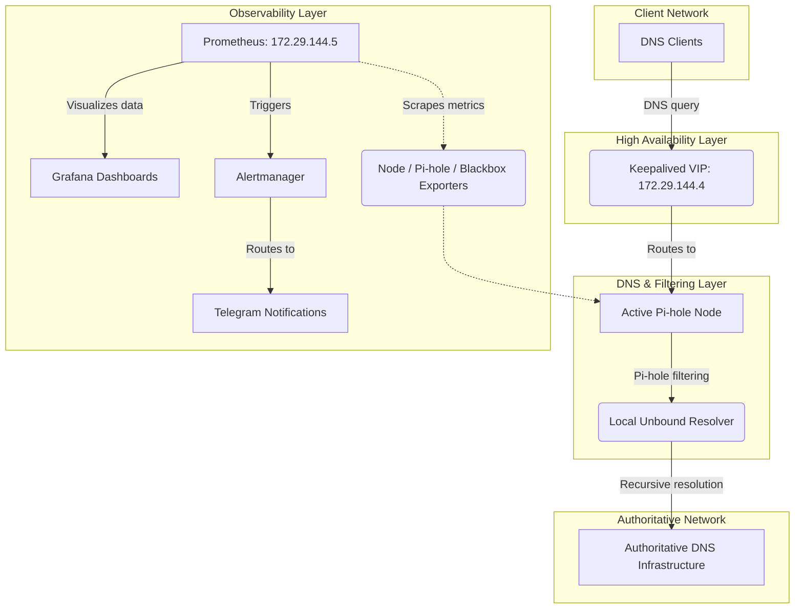

# 🏛️ Pi-hole HA Homelab Architecture

## 1. Overview
This project is a high-availability DNS infrastructure built as a personal homelab. The goal is to provide a reliable DNS service using two Pi-hole servers with Unbound as the recursive DNS resolver and Keepalived for high availability. The infrastructure also includes a dedicated monitoring server running Prometheus, Grafana, Alertmanager, and Blackbox Exporter. All virtual machines are hosted using Oracle VirtualBox.

---

## 2. Design Goals
The architecture was designed around several core principles:

* **High Availability:** DNS should continue working when one Pi-hole node becomes unavailable.
* **Privacy:** Unbound performs recursive DNS resolution locally rather than relying directly on a third-party DNS resolver.
* **Observability:** The infrastructure should be measurable and visible through metrics, dashboards, health checks, and alerts.
* **Recoverability:** The project includes backup and synchronization mechanisms to reduce the impact of configuration or node failures.
* **Learning:** The homelab acts as a practical learning environment for Linux administration, DNS, networking, high availability, and automation.

---

## 3. Network Topology & Components
The homelab operates on the `172.29.144.0/27` network. Clients do not directly depend on either Pi-hole server; instead, DNS clients use the Keepalived virtual IP address (VIP). This allows the DNS service to remain available if one of the active nodes fails.

| Host | IP Address | Role | Operating System |
|---|---|---|---|
| `pihole01` | `172.29.144.3` | Primary DNS server | Debian 13 |
| `pihole02` | `172.29.144.2` | Secondary DNS server | Debian 13 |
| `monitor01` | `172.29.144.5` | Monitoring server | Debian 13 |
| **HA VIP** | **`172.29.144.4`** | **DNS virtual IP** | **Keepalived** |

---

## 4. Logical Architecture (DNS & Observability)
The architecture separates the infrastructure into distinct functional layers. 

**The DNS Layer:** Each Pi-hole node provides DNS filtering and uses a local Unbound instance as its recursive DNS resolver. 
**The Observability Layer:** The `monitor01` node utilizes Blackbox monitoring for external HTTP, ICMP, and DNS checks, while scraping system and application metrics directly from the Pi-hole nodes. Alerts are delivered through Telegram.

---

## 5. Software Stack Summary

| Component | Purpose |
|---|---|
| **Debian 13 / VirtualBox** | Core operating system and virtualization platform. |
| **Pi-hole / Unbound** | DNS filtering and local recursive DNS service. |
| **Keepalived** | High-availability virtual IP management. |
| **Prometheus / Grafana** | Metrics collection, alert evaluation, and visualization. |
| **Exporters** | System (Node), application (Pi-hole), and active service (Blackbox) metrics. |
| **Alertmanager / Telegram** | Alert handling, routing, and mobile notifications. |