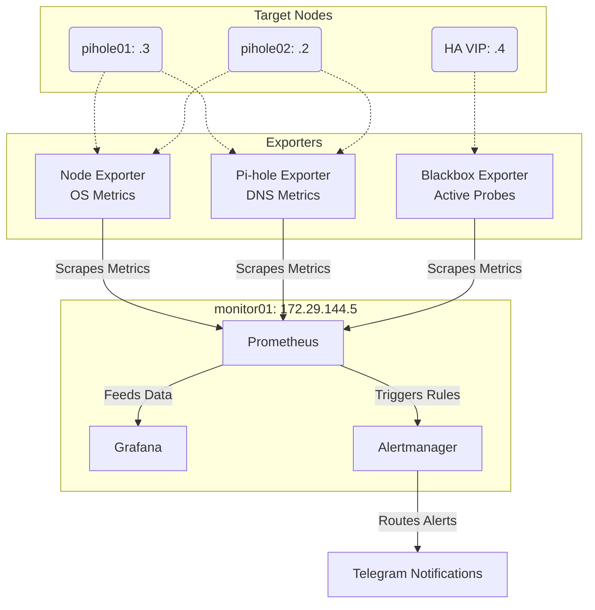

# 👁️ Monitoring and Observability

A dedicated monitoring VM (`monitor01` at `172.29.144.5`) provides visibility into the health, performance, and availability of the Pi-hole High Availability infrastructure. 

By separating the monitoring stack from the DNS nodes, we ensure that a failure on a Pi-hole node does not also take down the system responsible for detecting that failure.

---

## 🏗️ Observability Architecture

The project uses a 7-layer observability model to answer *what* failed, rather than just knowing that *something* failed:

1. **Operating System:** Node Exporter
2. **Application (Pi-hole):** Pi-hole Exporter
3. **Network/Service:** Blackbox Exporter
4. **Metrics Storage:** Prometheus
5. **Visualization:** Grafana
6. **Alerting:** Alertmanager
7. **Notification:** Telegram



---

## ⚙️ Core Components

### 1. Prometheus (Metrics Storage)
Prometheus is the central engine that periodically scrapes time-series data from the exporters and evaluates alert rules.

*Example `prometheus.yml` scrape configuration:*
```yaml
scrape_configs:
  - job_name: 'node_exporter'
    static_configs:
      - targets: ['172.29.144.2:9100', '172.29.144.3:9100']

  - job_name: 'pihole_exporter'
    static_configs:
      - targets: ['172.29.144.2:9617', '172.29.144.3:9617']

  - job_name: 'blackbox_dns'
    metrics_path: /probe
    params:
      module: [dns_udp]
    static_configs:
      - targets: ['172.29.144.4'] # Probe the VIP
```

### 2. Exporters (Data Collection)
Different exporters answer different questions:
*   **Node Exporter:** Is the operating system healthy? (CPU, Memory, Disk)
*   **Pi-hole Exporter:** Is the application functioning? (Query rates, block ratios)
*   **Blackbox Exporter:** Can a client actually reach the service? (HTTP, ICMP, DNS probes against the VIP)

### 3. Grafana (Visualization)
Grafana connects to Prometheus as a data source to visualize CPU utilization, DNS query rates, and node availability. 

### 4. Alertmanager & Telegram (Notification)
When Prometheus detects a condition matching an alert rule, it sends it to Alertmanager, which routes it to a Telegram bot.

*Important: Never commit sensitive Telegram credentials (`TELEGRAM_BOT_TOKEN`, `TELEGRAM_CHAT_ID`) to GitHub. Use environment variables or secrets management.*

---

## 🚨 Failure Scenarios & Troubleshooting

Monitoring the individual nodes (`.2` and `.3`) alongside the VIP (`.4`) allows us to isolate failures.

| Scenario | Symptoms | Diagnosis |
| :--- | :--- | :--- |
| **Single Node Failure** | `pihole01` Node Exporter DOWN<br>VIP Blackbox UP | Keepalived successfully failed over to `pihole02`. DNS is operational. |
| **Service Crash** | VM UP<br>Node Exporter UP<br>VIP Blackbox FAILED | The OS is running, but the Pi-hole/Unbound service has crashed. |
| **HA Failure** | `pihole01` UP<br>`pihole02` UP<br>VIP Blackbox DOWN | Both nodes are healthy, but Keepalived VRRP is broken. |
| **Total Outage** | Both Nodes DOWN<br>VIP DOWN | Critical failure. High-priority alert triggered. |

### Triage Checklist
When an alert fires, follow this structured path:
1. **Check Grafana:** Identify the anomaly (CPU spike, DNS drop, node unreachable).
2. **Check the Target Node:**
   ```bash
   pihole status
   sudo systemctl status unbound
   sudo systemctl status keepalived
   ```
3. **Check Prometheus/Exporters:** Verify the target isn't simply failing to scrape (`systemctl status prometheus`).

---

## 🔒 Security Considerations
*   Restrict Prometheus and Exporter network access (typically port `9090` and `9100`) to the monitoring subnet.
*   Protect Grafana with strong authentication.
*   Ensure Alertmanager webhook secrets are secured.