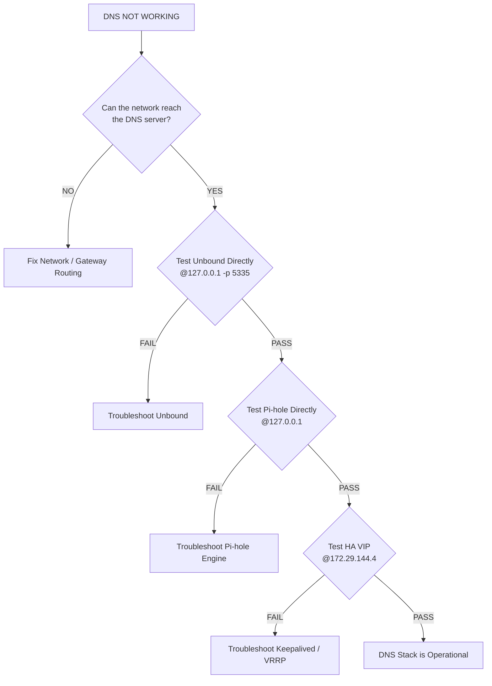

# 🚑 Troubleshooting & Disaster Recovery

When operating a High Availability (HA) homelab, the golden rule of troubleshooting is **layered diagnosis**. Do not change multiple components at the same time. 

Test the smallest possible component first, then move outward through the architecture: `Network → Unbound → Pi-hole → Keepalived → VIP → Monitoring`.

---

## 🌳 The DNS Diagnostic Decision Tree

Use this flow to isolate exactly which layer of the infrastructure is failing.

---

## 🛠️ Layer-by-Layer Diagnostic Commands

Always follow the safe configuration loop: **Edit → Validate → Restart → Test**.

### 1. Network Layer
If the VM cannot reach the gateway, DNS troubleshooting stops here.
*   Check assigned IPs: `ip addr`
*   Check routing: `ip route`
*   Test external connectivity: `ping 1.1.1.1`

### 2. Unbound Layer (Recursive DNS)
*   Check service state: `sudo systemctl status unbound`
*   Check listener port: `sudo ss -lntup | grep 5335`
*   **Validate Config:** `sudo unbound-checkconf`
*   Test resolution: `dig example.com @127.0.0.1 -p 5335`

### 3. Pi-hole Layer (DNS Filtering)
*   Check core service: `pihole status`
*   Check FTL engine: `systemctl status pihole-FTL`
*   View live logs: `journalctl -u pihole-FTL -f`
*   Test resolution: `dig example.com @127.0.0.1`

### 4. Keepalived Layer (High Availability)
*   Check service state: `sudo systemctl status keepalived`
*   **Validate Config:** `sudo keepalived -t`
*   Verify VIP ownership: `ip addr` (Look for `172.29.144.4` on the MASTER node)
*   Test resolution via VIP: `dig example.com @172.29.144.4`

---

## ⚠️ Known Issues & Specific Fixes

### Unbound: Missing Root Hints
*   **Symptom:** `unbound-checkconf` fails, reporting a missing file.
*   **Fix:** Verify the path using `grep -R "root-hints" /etc/unbound/` and ensure the downloaded root hints file actually exists at that location using `ls -l`.

### Unbound: Duplicate DNSSEC Trust Anchor
*   **Symptom:** `unbound-checkconf` reports a duplicate `auto-trust-anchor-file`.
*   **Fix:** Search for definitions using `grep -R "auto-trust-anchor-file" /etc/unbound/`. Remove the unintended duplicate from your configuration files.

### Keepalived: Both Nodes Claim the VIP (Split-Brain)
*   **Symptom:** Running `ip addr` shows `172.29.144.4` active on both `pihole01` and `pihole02`.
*   **Fix:** This indicates a VRRP communication failure. Check `journalctl -u keepalived`. Verify that both nodes share the same `virtual_router_id`, check for firewall rules blocking VRRP traffic, and ensure network connectivity exists between the nodes.

### Pi-hole: Overzealous Blocklists / Gravity Failures
*   **Symptom:** Legitimate domains fail to resolve, or gravity updates fail.
*   **Fix:** Run a manual gravity update (`pihole -g`) and carefully review the output for invalid URLs or database creation errors. If a valid domain is blocked, review the blocklist and add it to the allowlist.

---

## 👁️ Monitoring Stack Troubleshooting

The monitoring stack (`monitor01` at `172.29.144.5`) can fail independently of the DNS infrastructure. 

*   **Missing Metrics / Blank Grafana Dashboards:** Do not assume the target is down. Check if Prometheus is running (`systemctl status prometheus`) and verify if the individual exporters (Node, Pi-hole, Blackbox) are active on the target nodes.
*   **Alerts Not Reaching Telegram:** Trace the pipeline. Ensure Prometheus triggered the rule, Alertmanager routed it (`systemctl status alertmanager`), and the Telegram bot token and Chat ID are valid (do not commit these to GitHub).