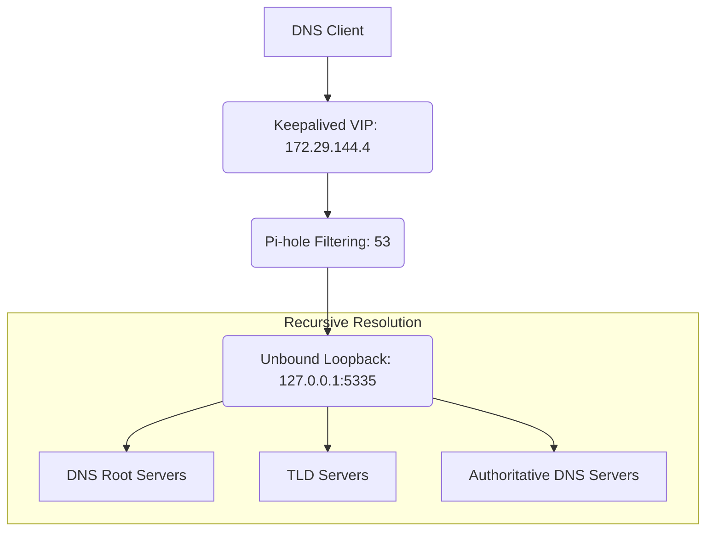

# 🌍 Unbound Recursive DNS Configuration

Unbound operates as the local recursive DNS resolver for both Pi-hole servers. Instead of forwarding DNS requests directly to a public DNS provider (like Google or Cloudflare), Pi-hole sends allowed queries to the local Unbound instance, which resolves them directly against the DNS Root and TLD servers.

## 📖 The "Why"
Running a local recursive resolver provides several security and privacy benefits:
* **Data Privacy:** Reduces dependency on third-party recursive DNS providers.
* **DNSSEC Validation:** Ensures DNS responses have not been cryptographically tampered with.
* **Independence:** Each Pi-hole node maintains its own independent Unbound instance (`pihole01` at `172.29.144.3` and `pihole02` at `172.29.144.2`), ensuring no single point of failure.

*(Note: Recursive DNS prevents third-party resolvers from logging your queries, but it does not encrypt traffic to hide it from your ISP. It is a control improvement, not complete anonymity).*

---

## 🏗️ Architecture Flow

Unbound listens strictly on the local loopback interface (`127.0.0.1:5335`). External network hosts cannot query Unbound directly; they must pass through Pi-hole first.



---

## ⚙️ Installation & Configuration

Install the Unbound package on both `pihole01` and `pihole02`:
```bash
sudo apt update && sudo apt install unbound -y
```

### Unbound Configuration File
To keep configurations maintainable, we isolate the Pi-hole specific settings into a dedicated file rather than modifying the main configuration directly. 

Create or edit `/etc/unbound/unbound.conf.d/pi-hole.conf` and add the following:

```yaml
server:
    # 1. Listener Configuration
    interface: 127.0.0.1
    port: 5335
    
    # 2. IPv6 Configuration (Disabled per homelab requirements)
    do-ip6: no
    prefer-ip6: no
    
    # 3. Thread Configuration (Lightweight VM workload)
    num-threads: 1
    
    # 4. Caching Configuration
    prefetch-key: yes
    serve-expired: yes
    serve-expired-ttl: 86400
```
*Note: This configuration balances performance and freshness by allowing Unbound to serve expired cached responses for up to 86400 seconds during upstream resolution problems, while using `prefetch-key` to keep DNSSEC data from going stale.*

---

## 🧪 Validation & Service Management

**Always validate the configuration before restarting the service.** A missing root hints file or a syntax error will cause the service to fail.

```bash
# 1. Validate the configuration
sudo unbound-checkconf

# 2. Restart and enable the service
sudo systemctl restart unbound
sudo systemctl enable unbound
```

### Testing DNS Resolution
Verify that Unbound is listening on the correct port and successfully resolving queries:
```bash
# Check the listener
sudo ss -lntup | grep 5335

# Test standard resolution (Look for status: NOERROR)
dig example.com @127.0.0.1 -p 5335
```

### Testing DNSSEC
Verify that Unbound properly rejects deliberately invalid DNSSEC data:
```bash
dig dnssec-failed.org @127.0.0.1 -p 5335
```

---

## 🛠️ Known Issues & Troubleshooting

If `unbound-checkconf` reports errors or the service fails to start, check the logs:
```bash
sudo journalctl -u unbound --since "10 minutes ago"
```

**Common Configuration Errors:**
*   **Missing Root Hints:** If validation fails due to a missing root hints file, verify the path using `grep -R "root-hints" /etc/unbound/` and ensure the file exists at that location (`ls -l`).
*   **Duplicate Trust Anchors:** If you receive a duplicate `auto-trust-anchor-file` error, search your configuration files (`grep -R "auto-trust-anchor-file" /etc/unbound/`). The trust anchor must only be configured once across all files.